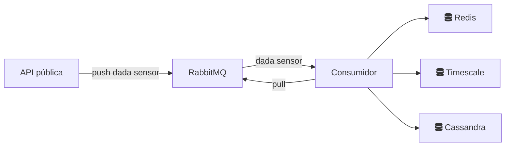

## Pràctica 7: Cues de Missatges

Benvingut/da a la setena pràctica de l'assignatura de Bases de dades. Aquesta pràctica parteix de la plantilla de la pràctica anterior. Com sabeu tenim una API REST que ens permet crear, esborrar, modificar i consultar les dades d'una aplicació de sensors. En aquesta pràctica volem ampliar el cas d'ús de la nostra API per a fer servir cues de missatges.

## Com començar?

Per començar, necessitaràs clonar aquest repositori. Pots fer-ho amb el següent comandament:

```bash
git clone url-del-teu-assignment
```

Recorda que fem servir docker-compose per a executar l'entorn de desenvolupament i provar el que anem desenvolupant. Per a arrancar l'entorn de desenvolupament, pots fer servir el següent comandament:

```bash
docker-compose up -d
```

Recorda parar l'entorn de desenvolupament de la setmana passada abans de començar a treballar amb aquesta pràctica.

Si vols parar l'entorn de desenvolupament, pots fer servir el següent comandament:

```bash
docker-compose down
```

Cal que tinguis en compte que si fas servir aquest comandament, no esborraràs tota la informació que tinguis a la base de dades, ja que per defecte down només esborra els conteidors i la xarxa entre ells. Si vols esborrar tota la informació que tinguis a la base de dades, pots fer servir el següent comandament:

```bash
docker-compose down -v
```

**Important**: Quan executem `docker-compose up`, Docker construeix una imatge de Docker amb FastAPI amb una fotografia estàtica del codi que tenim al directori. Això vol dir que si modifiquem el codi, no es veurà reflexat a l'entorn de desenvolupament. Per això, cal que executem docker-compose up cada cop que modifiquem el codi. Si no ho fem, no veurem els canvis que haguem fet.


### Context

Sembla que tot i els esforços de les últimes setmanes per a millorar la nostra API, encara no estem satisfets amb el rendiment que estem aconseguint. Ens arriben moltissimes requests de sensors que volen escriure dades de sensors i les nostres bases de dades no tenen capacitat per poder-les gestionar. Per això, hem decidit implementar un sistema de cues de missatges per a poder gestionar aquesta situació. Després de pensar maneres, hem vist que podem canviar una mica l'arquitectura de la nostra API per a afegir una cua i un sistema de productors i consumidors. Aquesta és la nova arquitectura:




Aquest tipus d'arquitectura ens permet desacoplar les escriptures de les dades i consumirles al ritme que puguin els consumidors (que a més a més podem escalar independentment). Aquesta arquitectura és molt comuna en sistemes de microserveis i orientats a events, ja que permet tenir sistemes molt escalables i molt fàcils de mantenir.

### Objectius

* Entendre com treballar amb cues de missatges.
* Crear una nova aplicació python que consumirà les dades de la cua i les escriurà a les bases de dades.
* Veure com es pot fer servir un sistema de cues de missatges per a desacoplar la lectura i escriptura de dades.

### RabitMQ
Per fer el pas de missatges usarem 
https://www.rabbitmq.com/

En els tutorials es pot veure el seu funcionament:
https://www.rabbitmq.com/getstarted.html
Concretament ens interessa el patró [Publish/Subscriber](https://www.rabbitmq.com/tutorials/tutorial-three-python.html).
S'han creat dues classes Publisher i Subscriber que s'encarreguen de fer la comunicació amb la cua de missatges, es troben als fitxers publisher.py i subscriber.py respectivament.

### Refactorització

Aquesta pràctica parteix de l'aplicació que ja coneixem però ens introdueix al paradigme dels seveis distribuïts.
Per això, veureu que ha aparegut una nova carpeta que recullira els fitxers d'una segona aplicació. Aquesta aplicació s'encarregarà de rebre les dades de la cua de missatges i escriure les dades a les bases de dades.

Entre l'endpoint de l'API a controller.py i les funcions del repository.py s'ha de crear la cua de missatges amb RabitMQ de tal manera que el controller cridi al Publisher.py amb el missatge que rep de l'API i amb el tòpic de quin Client de BD ho ha d'executar. El Subscriber.py rebrà aquest tòpic hi haurà de fer la crida al Client de BD tal i com s'estava fent fins ara.

A `controller.py` teniu comentat un objecte `publisher` de la classe `Publisher` que s'encarregarà de publicar els missatges a la cua de missatges. Creue-lo quan sigui necessari, penseu que el servei de rabbitmq ha d'estar en marxa per a que funcioni.

A `repository.py` teniu comentat un objecte `subscriber` de la classe `Subscriber` per a que es pugui subscriure a la cua de missatges i rebre els missatges que s'envien a la cua.  Creue-lo quan sigui necessari, penseu que el servei de rabbitmq ha d'estar en marxa per a que funcioni.

### Passar tots els tests creats anteriorment. 

Proveu tots els tests fets en les entregues anteriors per tal de veure que l'aplicació fuciona correctament. 

* Afegiu tots els fitxers `controller_test.py` la carpeta de tests. Renombreu-los segons el nom de cada pràctica 
*  A continuació fes servir el següent comandament, per executar-los tots:

```bash
docker exec bdda_api sh -c "pytest"
```

Si tot ha anat bé, hauries de veure que tots els tests passen.


## Entrega

Durant les pràctiques farem servir GitHub Classroom per gestionar les entregues. Per tal de clonar el repositori ja has hagut d'acceptar l'assignment a GitHub Classroom. Per entregar la pràctica has de pujar els canvis al teu repositori de GitHub Classroom. El repositori conté els tests i s'executa automàticament cada vegada que puges els canvis al teu repositori. Si tots els tests passen, la pràctica està correctament entregada.

Per pujar els canvis al teu repositori, has de fer servir el següent comandament:

```bash
git add .
git commit -m "Missatge de commit"
git push
```

## Puntuació

Aquesta pràctica té una puntuació màxima de 10 punts. La puntuació es repartirà de la següent manera:

- 6 punts: Correcta execució dels tests. 
- 2 punts: L'estil del codi i la seva estructura i documentació.
- 2 punts: La correcta implementació de la funcionalitat.

## Qüestionari d'avaluació de cada pràctica

Cada pràctica té un qüestionari d'avaluació. Aquest qüestionari ens permet avaluar el coneixement teòric i de comprensió de la pràctica. És obligatori i forma part de l'avaluació continua de l'assignatura. Per contestar el qüestionari, has d'anar al campus virtual de l'assignatura i anar a la secció de qüestionaris.
 


